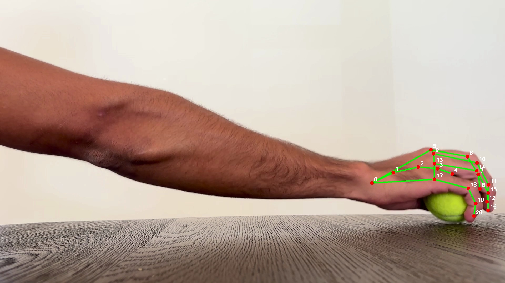
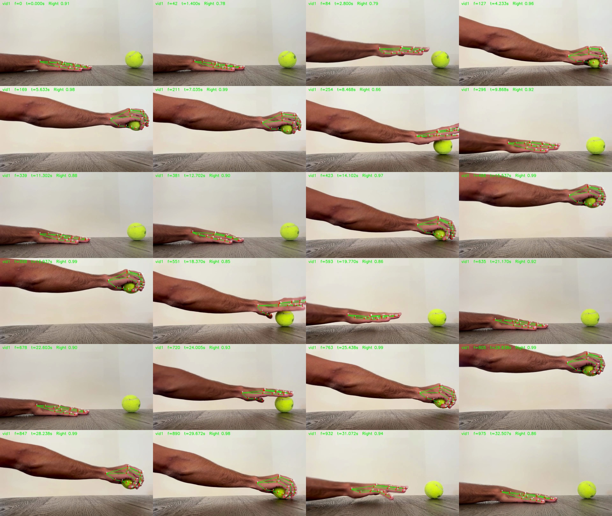
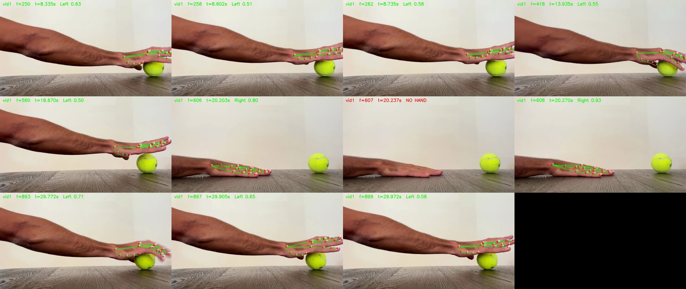
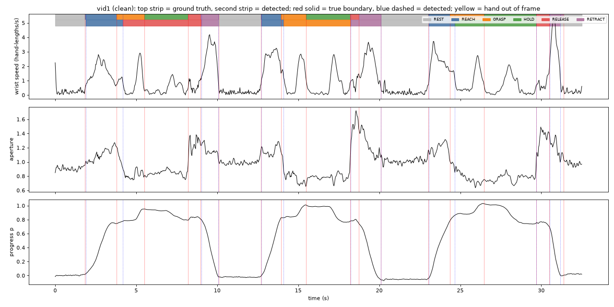
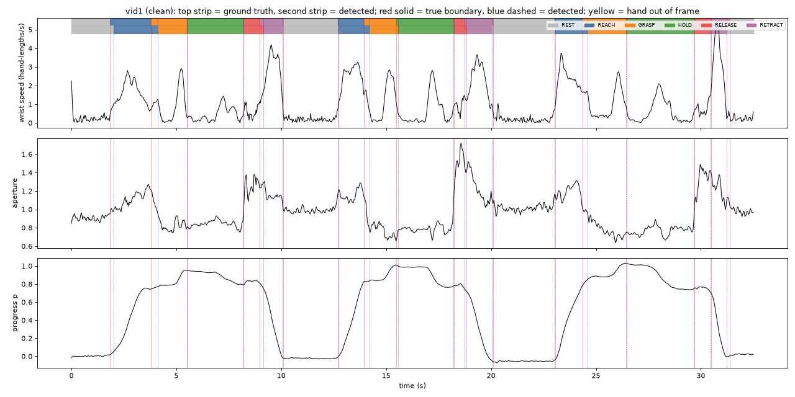
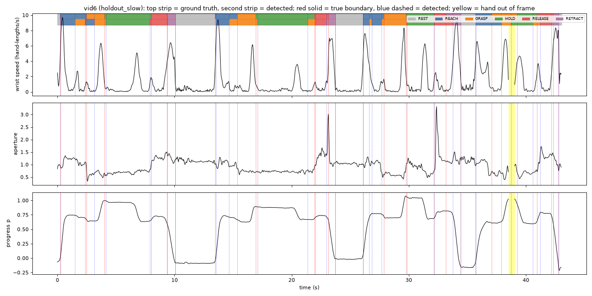

# Motion Intent Pipeline

An end-to-end data pipeline that turns recorded human hand motion into discrete "intent" events. A phone video of a hand reaching for, grasping, holding and setting down a ball becomes a labelled timeline of phases (REST, REACH, GRASP, HOLD, RELEASE, RETRACT), stored in a warehouse and shown on a dashboard.


*The published Tableau dashboard ([live on Tableau Public](https://public.tableau.com/app/profile/kian.hekmatnejad/viz/hand-motion-phases/Dashboard2)). Every bar, band and line was checked against the underlying data (see [Phase 5](#phase-5-tableau-dashboard)).*

**Non-negotiable constraint:** every claim made about this project must be true. No metric, accuracy number, or completed step is reported unless a test or a human review of the output verified it. If a stage's output looks wrong, the cause gets fixed (or documented), not tuned away. Limitations and failure modes are in [`NOTES.md`](NOTES.md).

## Contents

- [At a glance](#at-a-glance)
- [How the data flows](#how-the-data-flows)
- [Phase 1: Capture and keypoint extraction](#phase-1-capture-and-keypoint-extraction)
- [Phase 2: Segmentation model](#phase-2-segmentation-model)
- [Hold-out test on new recordings](#hold-out-test-on-new-recordings)
- [Phase 3: Databricks (PySpark)](#phase-3-databricks-pyspark)
- [Phase 4: Snowflake](#phase-4-snowflake)
- [Phase 5: Tableau dashboard](#phase-5-tableau-dashboard)
- [Running it](#running-it)
- [Repository layout](#repository-layout)
- [Final integration checklist](#final-integration-checklist)

## At a glance

| Phase | Stage | Status |
|---|---|---|
| 1 | Capture & keypoint extraction | **Complete.** 5 videos extracted, Postgres landing table loaded (row counts match), ground truth labelled for all 5 takes, overlays reviewed |
| 2 | Segmentation | **Complete (v2).** Frame accuracy 0.84–0.97 under leave-one-take-out CV (v1 baseline: 0.45–0.78); plots in `evidence/phase2_v2/` reviewed |
| — | Hold-out test | **Done.** Two new recordings scored once by the frozen model: frame accuracy **0.84** and **0.86**, the project's only unbiased figures |
| 3 | Databricks processing | **Complete.** PySpark signal derivation + event construction; 12/12 checks passed locally and on Databricks; Spark events identical to pandas events (101/101) |
| 4 | Snowflake | **Complete.** 7 tables loaded, 46/46 verification checks passed on Snowflake, 5 analytical queries (incl. `LAG`/`LEAD`) match an independent pandas recomputation |
| 5 | Tableau dashboard | **Built and published**, workbook and picture verified against the data. **Open:** first-time-viewer test (spec requirement) |

Test suite: 305 pytest checks; on 2026-10-06, 304 passed and 1 optional check was skipped. The Postgres tests need the database running.

**Headline numbers** (fraction of video frames given the same phase as a human labeller; tolerance 0.10 s; groups reported separately, never averaged):

| | Clean takes (vid1–3) | Fast take (vid4) | Hard take (vid5) | **New slow take (vid6)** | **New fast take (vid7)** |
|---|---|---|---|---|---|
| v1 rules baseline | 0.59–0.78 | 0.45 | 0.54 | — | — |
| v2 model, leave-one-take-out | 0.95–0.97 | 0.91 | 0.84 | — | — |
| v2 frozen model, unseen data | — | — | — | **0.84** | **0.86** |
| majority-label baseline | 0.25–0.31 | 0.36 | 0.26 | 0.31 | 0.29 |

## How the data flows

```
iPhone video ─► MediaPipe Hands ─► Postgres (raw_keypoints) ─► signals + segmentation (Python) ─► data/export/
                                                                                                    │
                     ┌──────────────────────────────────────────────────────────────────────────────┤
                     ▼                                    ▼                                          ▼
     Tableau tables (DuckDB, running the        Databricks / PySpark                       Snowflake warehouse
     same SQL views written for Snowflake)      (independent re-derivation of              (7 tables, row-count checks,
                     │                           signals and events, cross-checked)          5 analytical queries)
                     ▼
              Tableau Public
```

Databricks and Snowflake each load the exported tables and are verified against them. The dashboard's CSVs are produced by running the Snowflake view SQL (`snowflake/05_tableau_views.sql`) locally in DuckDB, because the free edition of Tableau does not connect to Snowflake (to the author's knowledge, not verified). Running those views in Snowflake and comparing the exports is supported (`scripts/compare_snowflake_results.py`) but has not been done yet.

**Tech stack:** Python 3.11+, pandas, NumPy · MediaPipe Hands · `ruptures` (changepoint detection) · scikit-learn (frame classifier) · PostgreSQL in Docker · Databricks (PySpark) · Snowflake · DuckDB (local SQL testing) · Tableau Public · pytest.

**Design choice to note:** the motion data comes from self-recorded video of a hand (keypoints extracted by computer vision), not from motion-sensor telemetry.

---

## Phase 1: Capture and keypoint extraction

**Goal:** turn a real video into a raw time-series table of `(timestamp, keypoint_id, x, y, z, confidence)`.

### The task being recorded

Seated at a table, one hand moves a tennis ball between two tape marks: **Home (A)** in front of the body and **Target (B)** about 40 cm away, across the camera's view. The iPhone is on a stand at table height, 1080p, 30 fps. Each cycle has six phases, and these labels are the ground-truth vocabulary for the whole project:

| # | Label | Action | Target duration | Expected signal |
|---|---|---|---|---|
| 0 | REST | Hand flat on A, still | 2 s | Near-zero wrist speed |
| 1 | REACH | Move A → object at B, opening fingers | ~1 s | Speed rises then falls; aperture increases |
| 2 | GRASP | Close hand on object, lift ~2 cm | ~0.5 s | Aperture drops sharply; little travel |
| 3 | HOLD | Hold lifted object still | 1 s | Near-zero speed; aperture stays closed |
| 4 | RELEASE | Set object down, open hand | ~0.5 s | Aperture rises; little travel |
| 5 | RETRACT | Return to A, hand flat | ~1 s | Speed rises then falls |
| 6 | REST | Still at A | 2 s | Near-zero speed |

Aperture = distance between thumb-tip and index-fingertip keypoints, normalized by hand size.

**The five takes**

| Take | Kind | What it tests |
|---|---|---|
| vid1–3 | Clean | The protocol exactly, with a clean stop at every phase boundary. Primary data |
| vid4 | Fast | Same phases, no deliberate stops, about half the time per phase. Boundaries exist only as aperture/direction changes |
| vid5 | Hard case (4 cycles) | Cycle 1 **hesitation** (pause mid-REACH, correct label: one REACH); cycle 2 normal; cycle 3 **failed grasp** (close, open, re-grasp; correct label decided in advance: one long GRASP); cycle 4 **occlusion** (hand rotated so the ball hides the fingertips) |

<details>
<summary>Full recording protocol</summary>

- Seated at a table, torso still, only the working arm moves; other hand in lap, out of frame.
- Two tape marks: **Home (A)** ~10 cm in front of the body, **Target (B)** ~40 cm from A, running *across* the camera view.
- One light, rigid, graspable object, identical in every take, placed at B.
- iPhone on a stand (never handheld), landscape, roughly table height, perpendicular to the A→B path. Plain non-reflective background, even lighting, no backlighting, short sleeves.
- 1080p at 30 fps (60 fps only if the Fast take shows motion blur). Action Mode and cinematic/portrait modes off.
- One slow dry run first to confirm fingertips stay visible during the grasp.
- Same path, same marks, same arc every cycle; one smooth motion per phase (corrections are detected as extra phases).
- Tap the table once at the start of every take (visual sync point).

</details>

### Extraction

Each recording (`vids/vid1–5.mov`) is converted to H.264 (`scripts/convert_videos.py`) and run through the MediaPipe Hand Landmarker (`src/extract.py`, `scripts/extract_take.py`), which returns 21 landmarks per frame. Output: `data/raw/vidN_keypoints.csv` (one row per frame × landmark) and `vidN_meta.json`. Real per-frame timestamps are used, since iPhone video is variable frame rate. Frames with no hand detected are kept as explicit NaN rows rather than dropped.



*vid1 at 5.0 s: the 21 landmarks (0 = wrist, 4 = thumb tip, 8 = index tip) tracked while the hand closes on the ball.*

**Human review of the overlays** (clips: `evidence/vid1_overlay.mp4` … `vid7_overlay.mp4`): vid1, vid2 and vid4 track well throughout. vid3 loses the hand on and off in the opening REST position. vid5 loses the hand at 9.335–9.835 s and 17.103–17.270 s because the hand is raised above the frame (physical absence, declared in `data/raw/out_of_frame_intervals.csv`, verified by `tests/test_data_gaps.py`).

<details>
<summary>Contact sheet: one vid1 frame every 1.4 s through all three cycles</summary>



Also: `evidence/vid5_contact_sheet.jpg` for the hard take.

</details>

### Data quality

Fraction of frames with no hand detected (`data/raw/detection_report.csv`). This is a real data-quality metric and is kept, not discarded:

| video | frames | not detected | sustained dropouts (s) |
|---|---|---|---|
| vid1 | 976 | 0.1% | none |
| vid2 | 1015 | 3.0% | none |
| vid3 | 775 | 2.7% | none |
| vid4 | 281 | 5.7% | none |
| vid5 | 913 | 6.4% | 9.34–9.80, 17.10–17.24 |



*Tracker quirks found in review: MediaPipe calls this right hand `Left` on 49 of 3,834 detected frames (1.3%), mostly low-confidence, isolated frames in moving phases, and occasionally loses a flat hand at rest for a frame (middle row, "NO HAND"). Handedness is never used to filter frames. Details in `NOTES.md`.*

- **Trimmed takes (data decision):** `vid3` and `vid4` originally ran longer and ended with footage that should not be in the dataset. `vid4.mov` was cropped by hand; `vid3.mov` was cut at the end only, to 25.805 s (775 frames, re-encoded HEVC 10-bit with the HLG colour tags kept, every frame timestamp identical to the original; checked). Neither was trimmed at the start, so timestamps still begin at 0. Untrimmed originals are kept locally in `vids_original/` (gitignored; the committed pre-trim versions are in git history). Detection numbers changed as a result (vid3 2.2%→2.7%, vid4 9.7%→5.7%). For vid4 the old dropouts at 10.40 s and 14.77 s are past the new end. For vid3 the old 0.53–0.67 s dropout is inside the kept range and no longer appears after re-encoding; that change is **not yet explained** (likely the re-encode altering what the tracker sees on that frame range).
- **Confidence signal:** the Hand Landmarker gives no per-landmark visibility score, so "confidence" is the per-frame `detected` flag plus `handedness_score`.

### Postgres landing table

A local Postgres table `raw_keypoints` (`docker-compose.yml`, `sql/001_raw_keypoints.sql`, `src/db.py`, `scripts/load_postgres.py`) is the dev/test source of truth. Row counts match the CSVs exactly for all five takes (20496 / 21315 / 16275 / 5901 / 19173). The loader is idempotent (it replaces a take in one transaction), and the table's CHECK constraint enforces that detected frames have coordinates and undetected frames have none.

### Ground truth

`ground_truth/take_1–5.csv` (columns `take, cycle, label, start_s, end_s, source`) were hand-labelled from the video frames using the overlay's `t=` stamp, with no audio cues. The scoring tolerance is **0.10 s** (3 frames), fixed before any segmentation was run. It was originally 0.2 s and was lowered because 0.2 s exceeds the shortest ground-truth segments.

---

## Phase 2: Segmentation model

**Goal:** convert the keypoint time series into a labelled sequence of events, each with start and end timestamps.

### Signals derived from the keypoints (`src/signals.py`)

Raw 21-landmark data is hard to segment directly, so each take is reduced to a few interpretable signals on a 30 Hz grid:

- **Wrist speed:** frame-to-frame wrist displacement, smoothed, in hand lengths per second. It separates moving from still phases.
- **Hand aperture:** thumb-tip to index-tip distance divided by hand size (wrist to middle-finger knuckle). It separates GRASP/HOLD (closed) from REACH/RELEASE (opening).
- **Progress `p`:** position along the home-to-target axis (0 = home, 1 = ball). Added in v2, together with **height above home** (`ydev`, `dy`) and **off-axis offset** (`q`, `dq`).

The segmentation plots below show speed, aperture and progress for each take.

### v1: rules + changepoints (baseline)

`ruptures` PELT (L2 cost) on √speed and aperture places the boundaries. A rule-based labeller then names each segment from its speed and aperture levels, and same-label neighbours are merged (`src/segment.py`). Its 10 parameters were tuned by seeded random search (800 trials) on vid1 and vid2 only.

v1 found the speed boundaries well (REST↔REACH, RETRACT↔REST, matched within about 0.03 s), but it could not separate **GRASP / HOLD / RELEASE**. In the real data those phases differ little in speed and share the same aperture, so PELT places no boundary between them. The merged block was then labelled from its end-of-segment trend, so GRASP+HOLD was often called RELEASE. Tuning thresholds could not fix this structural problem, which is why v2 exists. Full v1 analysis: `NOTES.md`, `data/segments/results.md`.

### v2: learned frame classifier + changepoints on phase probabilities

v2 keeps `ruptures` PELT for the boundaries but changes what it runs on:

1. **Features (`src/features.py`):** 61 per-frame features. Each signal is summarised over 4 window sizes (0.1–1.5 s). There are past-vs-future trend features (e.g. "aperture 0.5 s ahead minus 0.5 s behind"), plus rolling max/std of speed and rolling min of aperture. Features are computed from one take's own signals only.
2. **Frame classifier (`src/learned.py`):** a class-balanced gradient-boosting classifier (`HistGradientBoostingClassifier`) gives a probability for each of the six phases on every frame. Logistic regression was the other candidate; gradient boosting was chosen in every cross-validation fold.
3. **Training augmentation:** each training take is also used time-compressed by 1.5×, 2× and 3×, so fast motion is represented. This applies to training takes only; the scored take is never augmented or seen.
4. **Segmentation (headline decoder `v2_pelt`):** PELT on the smoothed phase probabilities finds the boundaries. Each segment gets the label with the highest mean probability, and adjacent equal labels merge. **The protocol's phase order is not used**, so out-of-order mistakes stay visible.
5. **Two reported variants:** `v2_argmax` (per-frame argmax, no changepoint step; diagnostic) and `v2_grammar` (Viterbi decoding constrained to the protocol's phase order). The grammar variant uses protocol knowledge, so it is reported separately and is not the headline.

**Evaluation protocol: nested leave-one-take-out.** Each take is scored by a model trained on the other four takes only (`scripts/cv_segmentation.py`; asserted in code and by `tests/test_v2_pipeline.py`). The classifier family, PELT penalty and grammar penalty are chosen by an inner leave-one-take-out over those four takes, so the scored take influences nothing. Selection details: `data/segments/cv_selection.json`.

**Leakage control** (`tests/test_leakage_control.py`): trained on vid1–2 and applied to vid3, correctly aligned labels give 0.94 frame accuracy, and the same labels shifted in time give 0.01. The classifier learns real phase signatures, not positions in the recording.

### Results

Every take is scored by a model that never saw it. Tolerance 0.10 s. Numbers are from `data/segments/history.csv`, where every scored version is logged.

| take | group | frame acc v1 → v2 | balanced acc v2 | boundary recall v1 → v2 | precision v2 | MAE matched (s) v2 |
|---|---|---|---|---|---|---|
| vid1 | clean | 0.68 → **0.95** | 0.93 | 0.50 → 0.67 | 0.67 | 0.042 |
| vid2 | clean | 0.78 → **0.97** | 0.96 | 0.78 → 0.83 | 0.83 | 0.048 |
| vid3 | clean | 0.59 → **0.96** | 0.96 | 0.61 → 0.83 | 0.83 | 0.031 |
| vid4 | fast | 0.45 → **0.91** | 0.79 | 0.33 → 0.78 | 0.93 | 0.031 |
| vid5 | hard | 0.54 → **0.84** | 0.83 | 0.54 → 0.75 | 0.67 | 0.035 |

On the clean and fast takes, "tolerant" accuracy (wrong frames within 0.1 s of a true boundary also count) is about 1.0. Almost every remaining error is timing jitter at a boundary, not a wrong phase. vid5 per cycle (frame accuracy, v1 → v2): hesitation 0.73 → 0.97, normal 0.86 → 0.87, failed grasp 0.46 → 0.78, occlusion 0.21 → 0.78.

**Before and after on the same take.** Each plot shows wrist speed, aperture and progress for vid1. The top colour strip is the human label and the strip under it is the model's. Red solid lines mark true boundaries, blue dashed lines detected ones.

v1 (rules): the GRASP + HOLD block around 4–8 s is merged and labelled RELEASE (red), and in the second cycle the HOLD is labelled GRASP (orange).



v2 (learned classifier): the two strips line up almost everywhere. Remaining differences are small boundary offsets.



Plots for every take: `evidence/phase2/` (v1), `evidence/phase2_v2/` (v2).

### Known problems

1. **RELEASE in the fast take is still missed (0.00).** The true segments last 0.13 s (about 4 frames), and those frames go to HOLD and RETRACT.
2. **vid5 REACH accuracy 0.59.** The hand approaches slowly and lingers open near the ball before grasping, and the classifier calls the lingering GRASP.
3. **Occlusion cycle (vid5 cycle 4):** aperture drops far outside the training range. The output has a spurious 0.36 s REST and a HOLD/GRASP flip.
4. **No hand data:** frames in the two out-of-frame intervals score 0.50 (10 of 20), reported separately.

**How optimistic are these numbers?** The design (features, augmentation factors, the switch to a learned classifier) was informed by all five takes, and vid1–3 come from one session. Cross-validation keeps each take out of its own model but not out of the design process. The labeller is also no longer rule-based: v2 trades explainability for accuracy, and v1 remains as the explainable baseline. The hold-out test below gives the unbiased check.

### Frozen model and exported tables

The v2 model is frozen in `models/segmenter_v2.joblib`. Its `.json` records the file hash, library versions, training takes, feature columns and the PELT penalty (1.0, chosen as the best mean objective over the leave-one-out predictions; the objective is flat from 0.5 to 2.0). `tests/test_frozen_model.py` fails if the file or features change. The canonical events are out-of-fold: each take is predicted by a model that never saw it. Scored as `v2_frozen_oof`, frame accuracy is 0.95 / 0.97 / 0.97 / 0.91 / 0.84 for vid1–5; these are the values on the dashboard. New takes are segmented with `src.final.segment_new_take(take)` without retraining.

`scripts/export_tables.py` writes `data/export/`, the tables for the later phases: `events` (101 rows), `signals` (3,960), `frames` (3,960), `ground_truth` (101), `takes` (5), `scores` (10), and `raw_keypoints.parquet` (83,160 rows, read straight from Postgres). It also writes a `manifest.json` of row counts and SHA-256 hashes. `tests/test_export.py` checks that events partition every frame exactly once and that counts and hashes match.

---

## Hold-out test on new recordings

Two new takes, **vid6** (4 slow cycles) and **vid7** (3 fast cycles), were labelled by the project owner, locked (SHA-256 of the label and model files recorded), then scored **once** by the frozen model with no retraining or tuning (`scripts/run_new_take.py`, steps in `docs/new_takes.md`). These are the project's only unbiased figures:

| take | kind | frames scored | frame accuracy | balanced | tolerant | boundary recall / precision | matched-boundary error (s) | majority baseline | chance recall |
|---|---|---|---|---|---|---|---|---|---|
| vid6 | slow, 4 cycles | 1,277 (+14 out of frame) | **0.839** | 0.825 | 0.879 | 0.50 / 0.40 | 0.042 | 0.31 | 0.13 |
| vid7 | fast, 3 cycles | 383 (+25 out of frame) | **0.862** | 0.892 | 0.950 | 0.56 / 0.59 | 0.050 | 0.29 | 0.22 |

On new data the model scores 0.84 and 0.86, against 0.95–0.97 for the clean takes and 0.91 for the fast take under leave-one-take-out. The earlier figures were optimistic, as stated beforehand, but both takes remain far above the baselines.



*vid6 (never seen by the model). The main error is visible in the colour strips: when the hand reaches quickly and then waits open near the ball, the model labels the wait GRASP (orange), splitting REACH into REACH, GRASP, REACH, GRASP. Yellow marks where the hand left the frame.*

- **Lingering approach read as grasping (vid6):** 61 of 220 REACH frames go to GRASP. This is the failure first seen in vid5, now reproduced on unseen data. Slow motion is outside the training augmentation, which only sped takes up.
- **REST timing in the fast take (vid7):** phases are mostly right (tolerant accuracy 0.95), but REST boundaries are 0.2–0.3 s off.
- **Not tested:** vid7's releases last 0.43–0.60 s, so vid4's 0.13 s RELEASE problem is still untested on new data. Both takes are by the same person with the same object, so this is not a test of other people, objects or camera positions.
- **A real bug was found:** the conversion forced a fixed time base, which rounded vid6's timestamps by up to 1.2 ms. `tests/test_extraction.py` caught it; it was fixed and tested, and vid6 was re-extracted before locking.

Full analysis and every fix: `NOTES.md`. Outputs: `data/holdout/`; plots: `evidence/holdout/`.

---

## Phase 3: Databricks (PySpark)

**Goal:** reimplement a meaningful part of the pipeline on Spark DataFrames rather than relocating pandas code into a notebook.

**What runs in Spark** (`databricks/spark_transforms.py`, generated notebook `databricks/motion_pipeline_spark.py`):

- **Signal derivation from raw keypoints:** a conditional aggregation pivots the 21 landmark rows into one row per frame. Window functions partitioned by take and ordered by frame compute a `lag`/`lead` central-difference velocity using the real, variable frame timestamps, and `avg` over `rowsBetween(-2, 2)` smooths it. A `groupBy/agg` with an exact `percentile` gives per-take hand size, joined back with a broadcast join.
- **Event construction:** gaps-and-islands (`lag` + cumulative-sum window + `groupBy/agg` + `lead`) turns per-frame labels into events, and a range join computes per-event stats.

**Scope decision (flagged):** the gradient-boosting classifier and `ruptures` have no sensible Spark equivalent, so the frozen model's per-frame labels are an input table. The events are *built* in Spark from labels produced in Python; the segmentation itself does not run in Spark.

**Verification:** run locally (Spark 3.5.5, `tests/test_spark.py`) and on Databricks (Free Edition, serverless). All 20 cells finished and all 12 checks passed. The Databricks export is saved as `evidence/databricks_phase3.html` and asserted by `tests/test_databricks_evidence.py`.

- Row counts: raw 83,160 = 21 × 3,960 frames; Spark frames and signals = pandas frames for every take.
- Spark events = pandas events, 101 of 101, with identical label, start, end and frame count.
- Signals agree but are not identical, because the methods differ (central difference + 5-frame average vs. a 30 Hz grid + Savitzky–Golay). Pearson r for speed is 0.98–0.99 on every take. For aperture it is 0.99 on every take except the fast vid4 (0.87), where phases last only a few frames.
- **A bug was caught by these checks:** central differences initially gave undetected frames a speed from their neighbours (silent interpolation). Fixed by masking undetected frames.

Run steps: `databricks/README.md`.

---

## Phase 4: Snowflake

**Goal:** land the structured tables in Snowflake as the queryable layer.

`scripts/build_snowflake_scripts.py` generates `snowflake/01_setup.sql` (database, schema, stage, 7 tables), `02_load.sql` (`COPY INTO` from the stage) and `03_verify.sql` (46 checks). The expected values come from `data/export/manifest.json`, not from the loaded tables. Loaded tables: `takes` (5), `events` (101), `ground_truth` (101), `signals` (3,960), `frames` (3,960; the per-frame aggregate of the raw keypoints), `scores` (10), and the full `raw_keypoints` (83,160).

**Analytical queries** ([`queries.sql`](queries.sql)):

1. Average duration of each event type, by take kind
2. Which takes have the most ambiguous events (shorter than 0.3 s or low model confidence)
3. Time between consecutive REACH events (`LAG`)
4. Phase transitions and whether they follow the protocol order (`LEAD`)
5. Model agreement with the human labels, per phase

**Verification (run on Snowflake, 2026-10-05):** 46 of 46 checks `PASS`, with row counts equal to the manifest. All five query results (downloads in `snowflake/actual_results/`) match the locally produced results exactly. They also match an independent pandas recomputation from the exported CSVs with no SQL (`tests/test_snowflake_evidence.py`). Locally, the SQL is tested in DuckDB, and six deliberate corruptions (a deleted row, a shifted start, a duplicated event…) are each caught.

The results make sense against the videos: clean-take HOLD averages 2.65 s; the fast take has no RELEASE events (the known miss); every clean-take transition follows the protocol order; cycle time is about 10–12 s clean, 2.5 s fast, 6–9 s hard; vid5 ranks most ambiguous. The person who watched the videos confirmed these against `snowflake/sanity_check_checklist.md` (a verbal sign-off; the filled-in checklist was not saved).

**Not proved:** values in `raw_keypoints` and `frames` are verified only by row counts and a NULL check. The optional value-level `04_fingerprint.sql` has not been run on Snowflake. Run steps and details: `snowflake/README.md`.

---

## Phase 5: Tableau dashboard

**Goal:** one dashboard a non-technical viewer can read at a glance.

The dashboard at the top of this page was built by the project owner in Tableau Public from `data/tableau/*.csv`. Workbook: `tableau/hand-motion-phases.twbx`. Published: [Tableau Public](https://public.tableau.com/app/profile/kian.hekmatnejad/viz/hand-motion-phases/Dashboard2). It has four charts:

1. **Speed vs hand opening:** one point per moment, coloured by the detected phase. The phases form visible clusters: Releasing sits at the widest hand opening, Grasping and Holding at the narrowest.
2. **What the hand was doing:** the detected phase timeline for each recording.
3. **How fast the wrist was moving:** the speed signal, one panel per recording, on the same time axis as the timeline. The fast take's compressed cycles and the hard take's gaps (hand out of frame) are visible.
4. **How often the computer matched a human labeller:** frame accuracy per take.

**Verified** (`scripts/verify_dashboard_image.py`, `tests/test_tableau_dashboard_evidence.py`):

- **Workbook:** it packages exactly the three tested CSVs (byte-identical to `data/tableau/`), and each sheet uses the expected fields.
- **Picture:** the timeline bands decode to exactly the detected events for all 5 takes (19, 19, 19, 16, 28 segments, same phases in the same order, starts within 0.046 s). The accuracy bars decode to 94.9, 96.6, 96.6, 91.1 and 84.1, equal to the scored values. The speed lines correlate 0.961–0.985 with the real signal. The scatter's vertical order matches the data (rank correlation 0.94); its horizontal check is weak (0.77) because overlapping circles hide the dense low-speed region, so its data binding is verified from the workbook instead.
- **Published copy:** on 2026-10-06 the Tableau Public page showed the same four charts and accuracy labels as the export (a visual check only).
- **Data tables:** `tests/test_tableau_tables.py` checks that segments are contiguous, that counts match the sources, that accuracy equals the scored values, and that speed is empty exactly where the hand was out of view.

**Open:** the first-time-viewer test (`tableau/user_test.md`). The spec says the dashboard is not done until someone new can describe it.

<details>
<summary>Still worth fixing (readability; none affects the data)</summary>

1. Colours are still Tableau's defaults, so "At rest" uses the same blue as the speed lines and the accuracy bars.
2. The phase legend appears twice and is titled "Phase Name". Keep one legend and retitle it "What the hand is doing".
3. Row headers read "Take Label". Rename them to "Recording".
4. The speed panels' y-axis numbers are clipped ("1." instead of 10) and have no title or unit. Widen the axis and title it "Wrist speed (hand lengths per second)".
5. The timeline axis says "Start time (seconds)". It shows time, so "Time (seconds)" is accurate.
6. There is no caption explaining what the picture shows.
7. Accuracy labels show two decimals ("94.90%"), and the Take 2 and 3 labels are dark text on dark bars.
8. The scatter does not say its colours are the *detected* phase.
9. Sheets are named "Sheet 1" to "Sheet 4" and the dashboard "Dashboard 2", which shows in the public URL. The accuracy table is attached twice as two data sources.

Items 4 and 6 are the most likely causes of a failed viewer test.

</details>

Build steps and data dictionary: `tableau/README.md`.

---

## Running it

```bash
docker-compose up -d db            # Postgres 16 on localhost:5433
python scripts/load_postgres.py    # init schema, load all takes, verify row counts
pytest                             # Postgres tests fail (not skip) if the DB is down
```

| Step | Command |
|---|---|
| Segmentation, cross-validated (several minutes) | `python scripts/cv_segmentation.py` |
| Score and plot v2 | `python scripts/score_segmentation.py --events-dir data/segments/v2_pelt --version v2_pelt` then `python scripts/plot_segmentation.py --events-dir data/segments/v2_pelt --out-subdir phase2_v2` |
| v1 baseline | `python scripts/run_segmentation.py` |
| Freeze model and export tables | `python scripts/freeze_model.py && python scripts/score_segmentation.py --events-dir data/segments/v2_frozen_oof --version v2_frozen_oof && python scripts/export_tables.py` |
| New recordings, end to end | `python scripts/run_new_take.py` (see `docs/new_takes.md`) |
| Tableau tables | `python scripts/make_tableau_tables.py` |
| Databricks | `databricks/README.md` |
| Snowflake | `snowflake/README.md` |

## Repository layout

```
vids/             original iPhone recordings
src/              extract, landmarks (MediaPipe), db (Postgres loader), signals, features, learned,
                  segment (v1), score, evaluate, ground_truth, final (frozen model), holdout
scripts/          convert, extract, detection report, overlays, load_postgres, segmentation, CV,
                  scoring, plotting, export, Snowflake/Databricks/Tableau builders
sql/              Postgres DDL
data/raw/         per-take keypoint CSVs, meta JSON, detection_report.csv
data/segments/    v1 events + params.json; v2_pelt / v2_grammar / v2_argmax / v2_frozen_oof;
                  history.csv (every scored version); cv_selection.json
data/export/      tables for Databricks / Snowflake / Tableau + manifest.json
data/holdout/     hold-out test for vid6 and vid7: lock, events, scores, run record, export, Tableau tables
data/tableau/     Tableau-ready CSVs
models/           frozen segmenter (joblib + json metadata)
databricks/       PySpark transforms, generated notebook, run instructions
snowflake/        generated setup / load / verify SQL, expected and actual results, run instructions
tableau/          workbook (hand-motion-phases.twbx), build steps, first-time-viewer test, target image
evidence/         overlay clips, contact sheets, segmentation plots, Databricks export, dashboard export
ground_truth/     take_N.csv hand-labelled phase boundaries
docs/             phase2_roadmap.md, new_takes.md
tests/            pytest suites
queries.sql       the 5 Snowflake analytical queries
NOTES.md          limitations, failure modes and disclosures
```

## Final integration checklist

- [x] Full pipeline runs end to end on at least one video, from raw footage to Tableau-ready export, without manual patching of intermediate files: vid6 and vid7 via `scripts/run_new_take.py` (2026-10-06). The run exposed one bug (time base), fixed in code before vid6 was re-run; the human inputs (label files, out-of-frame list) needed formatting fixes. See `NOTES.md`
- [ ] Every number reported about the project has a test or saved output that produced it
- [x] `NOTES.md` documents real limitations and failure modes (tracking, segmentation, hold-out results)
- [ ] This README matches what is actually built (no planned features described as done). Restructured and checked against the docs on 2026-10-06; leave unticked until the viewer test is done

## Ground rules for AI assistants

See `CLAUDE.md`. In short: never mark a phase complete without its tests passing and shown; never fabricate or estimate a metric; stop and say so when a result looks wrong; flag any scope-simplifying decision explicitly.
