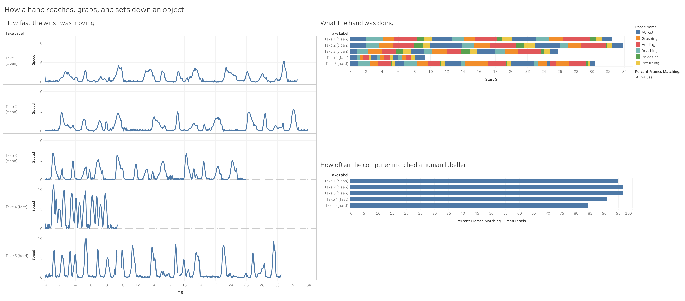

# Motion Intent Pipeline

An end-to-end data pipeline that turns recorded human hand motion into discrete "intent" events:

```
iPhone video → MediaPipe Hands → Postgres (raw) → Segmentation → Databricks (Spark) → Snowflake → Tableau
```

## Status

Phase 1 is complete (extraction, Postgres landing table, ground truth, overlay review, tests). Phases 2 and 3 are complete. Phase 4 is complete (run on Snowflake and verified). Phase 5: dashboard built, published and its data verified; the first-time-viewer test is still open.

| Phase | Stage | Status |
|---|---|---|
| 1 | Capture & keypoint extraction | **Complete.** 5 videos extracted, Postgres landing table loaded (row counts match), ground truth labelled for all 5 takes, overlays reviewed, 305 pytest checks (304 pass, 1 optional skip). Known limitations in `NOTES.md` |
| 2 | Segmentation | **Complete (v2); plots in `evidence/phase2_v2/` reviewed.** 305 pytest checks (304 pass, 1 optional skip). Frame accuracy 0.84–0.97 under leave-one-take-out CV (v1: 0.45–0.78); caveats in `NOTES.md` |
| 3 | Databricks processing | **Complete.** PySpark signal derivation + event construction; 12/12 checks passed locally and on Databricks (evidence saved); Spark events identical to pandas events (101/101). See `databricks/README.md`, `NOTES.md` |
| 4 | Snowflake | **Complete.** 7 tables loaded, 46/46 verification checks passed on Snowflake, 5 queries (incl. `LAG`/`LEAD`) match expected results and an independent pandas recomputation. Optional value-level fingerprint not yet run. See `snowflake/README.md`, `NOTES.md` |
| 5 | Tableau dashboard | **Built and published** (4 charts; workbook `tableau/hand-motion-phases.twbx`; export `evidence/tableau_dashboard.png`; Tableau Public link in `tableau/README.md`). Workbook and picture verified against the data. **Open:** first-time-viewer test (spec requirement). |

### Phase 1: what exists (verified by `pytest`, run against real output)

- Five recordings in `vids/vid1–5.mov`, converted to H.264 (`scripts/convert_videos.py`) and run through MediaPipe Hand Landmarker (`src/extract.py`, `scripts/extract_take.py`). Output: `data/raw/vidN_keypoints.csv` (one row per frame × 21 landmarks) and `vidN_meta.json`. Real per-frame timestamps are used (iPhone video is variable frame rate); undetected frames are kept as explicit NaN rows.
- Fraction of frames with no hand detected (`data/raw/detection_report.csv`):

| video | frames | not detected | sustained dropouts (s) |
|---|---|---|---|
| vid1 | 976 | 0.1% | none |
| vid2 | 1015 | 3.0% | none |
| vid3 | 775 | 2.7% | none |
| vid4 | 281 | 5.7% | none |
| vid5 | 913 | 6.4% | 9.34–9.80, 17.10–17.24 |

- **Trimmed takes (data decision):** `vid3` and `vid4` originally ran longer and ended with footage that should not be in the dataset. `vid4.mov` was cropped by hand; `vid3.mov` was cut at the end only, to 25.805 s (775 frames, re-encoded HEVC 10-bit with the HLG colour tags kept, every frame timestamp identical to the original; checked). Neither was trimmed at the start, so timestamps still begin at 0. Untrimmed originals are kept locally in `vids_original/` (gitignored; the committed pre-trim versions are in git history). Their detection numbers changed (vid3 2.2%→2.7%, vid4 9.7%→5.7%, and the sustained dropouts previously listed for both are gone). For vid4 the old dropouts at 10.40 s and 14.77 s are past the new end; for vid3 the old 0.53–0.67 s dropout is inside the kept range and no longer appears after re-encoding. That vid3 change is **not yet explained** (likely the re-encode altering what the tracker sees on that frame range); worth a look at the overlay.
- Local Postgres landing table `raw_keypoints` (`docker-compose.yml`, `sql/001_raw_keypoints.sql`, `src/db.py`, `scripts/load_postgres.py`). Row counts match the CSVs exactly for all five takes (20496 / 21315 / 16275 / 5901 / 19173). The loader is idempotent (replaces a take in one transaction) and the table's CHECK constraint enforces that detected frames have coordinates and undetected frames have none.
- Overlay clips and contact sheets in `evidence/`. **Human review result:** vid1, vid2 and vid4 track well throughout; vid3 loses the hand on and off in the opening REST position; vid5 loses the hand at 9.335–9.835 s and 17.103–17.270 s because the hand is raised above the frame (physical absence, declared in `data/raw/out_of_frame_intervals.csv`, verified by `tests/test_data_gaps.py`). Details and consequences in `NOTES.md`.
- Ground truth: `ground_truth/take_1–5.csv`, hand-labelled from the video frames (no audio cues), scoring tolerance 0.10 s. vid5 has four cycles. Mapping: vid1–3 clean, vid4 Fast, vid5 Hard case.
- `Left` handedness on 49 of 3,834 detected frames (1.3%) of a right hand is a MediaPipe quirk (low-confidence, isolated frames in moving phases). Handedness is never used to filter frames. See `NOTES.md`.

Run it:

```
docker-compose up -d db            # Postgres 16 on localhost:5433 (separate from other projects' DBs)
python scripts/load_postgres.py    # init schema, load all takes, verify row counts
pytest                             # needs the DB loaded; Postgres tests fail (not skip) if it is down
```

### Phase 2: segmentation (built, scored, improved)

**v1 (rules + PELT on raw speed/aperture)** was the baseline; **v2 (learned frame classifier + PELT on phase probabilities)** replaces it as the working result. Details, protocol, failure modes and disclosures: `NOTES.md`. Code: `src/signals.py`, `src/features.py`, `src/learned.py`, `src/segment.py` (v1), `src/score.py`, `src/evaluate.py`; scripts `cv_segmentation.py` (nested leave-one-take-out CV), `score_segmentation.py`, `plot_segmentation.py`.

Every take is scored by a model trained on the *other four* takes only. Tolerance 0.10 s. Reported per group, never pooled; numbers from `data/segments/history.csv` (every scored version is logged there):

| take | group | frame acc v1 → v2 | balanced acc v2 | boundary recall v1 → v2 | precision v2 | MAE matched (s) v2 |
|---|---|---|---|---|---|---|
| vid1 | clean | 0.68 → **0.95** | 0.93 | 0.50 → 0.67 | 0.67 | 0.042 |
| vid2 | clean | 0.78 → **0.97** | 0.96 | 0.78 → 0.83 | 0.83 | 0.048 |
| vid3 | clean | 0.59 → **0.96** | 0.96 | 0.61 → 0.83 | 0.83 | 0.031 |
| vid4 | fast | 0.45 → **0.91** | 0.79 | 0.33 → 0.78 | 0.93 | 0.031 |
| vid5 | hard | 0.54 → **0.84** | 0.83 | 0.54 → 0.75 | 0.67 | 0.035 |

Known problems: RELEASE in the fast take is still missed (0.13 s segments); vid5's long pause before grasping is read as GRASP early; the occlusion cycle is noisy. These numbers are optimistic: the design was informed by all five takes and vid1–3 come from one session (see `NOTES.md`). A newly recorded take would give an unbiased check.

Run: `python scripts/cv_segmentation.py` (several minutes), then `python scripts/score_segmentation.py --events-dir data/segments/v2_pelt --version v2_pelt` and `python scripts/plot_segmentation.py --events-dir data/segments/v2_pelt --out-subdir phase2_v2`. v1: `scripts/run_segmentation.py`.

### Phase 2: frozen model and exported tables

The v2 model is frozen in `models/segmenter_v2.joblib` (+ `.json` with hash, training takes, penalty and feature columns). The canonical events are out-of-fold (each take predicted by a model that never saw it; scored as `v2_frozen_oof`: frame accuracy 0.95 / 0.97 / 0.97 / 0.91 / 0.84 for vid1–5). `data/export/` holds the tables for the next phases (`events`, `signals`, `frames`, `ground_truth`, `takes`, `scores`, `raw_keypoints.parquet`) with a `manifest.json` of row counts and hashes. New takes can be segmented with `src.final.segment_new_take(take)`; nothing is retrained. Details: `NOTES.md`.

Run: `python scripts/freeze_model.py && python scripts/score_segmentation.py --events-dir data/segments/v2_frozen_oof --version v2_frozen_oof && python scripts/export_tables.py`.

### Phase 5: Tableau dashboard (built and published; viewer test open)



Built by the project owner in Tableau Public from `data/tableau/*.csv` (produced by the views in `snowflake/05_tableau_views.sql`; the free edition does not connect to Snowflake, to the author's knowledge). Workbook: `tableau/hand-motion-phases.twbx`. Published: [https://public.tableau.com/app/profile/kian.hekmatnejad/viz/hand-motion-phases/Dashboard2](https://public.tableau.com/app/profile/kian.hekmatnejad/viz/hand-motion-phases/Dashboard2).

Four charts: (1) wrist speed against hand opening, one point per moment, coloured by the detected phase; (2) what the hand was doing in each recording (detected phases); (3) how fast the wrist was moving, one panel per recording; (4) how often the computer's labels matched a human labeller.

**Verified** (`scripts/verify_dashboard_image.py`, `tests/test_tableau_dashboard_evidence.py`):

- **Workbook** (`tableau/hand-motion-phases.twbx`): it packages exactly the three tested CSVs (byte-identical to `data/tableau/`); the timeline is restricted to detected phases by a data-source filter (`source = Detected`); each sheet uses the expected fields (timeline: `start_s` sized by `duration_s`, coloured by `phase_name`; speed: `speed` over `t_s` per take; scatter: one point per sample of `speed` against `aperture`, coloured by the detected phase; accuracy: `percent_frames_matching_human_labels`).
- **Picture** (`evidence/tableau_dashboard.png`): the timeline bands decode to exactly the detected events for all 5 takes (19, 19, 19, 16, 28 segments, same phases in the same order; starts within 0.046 s, about 1.6 pixels); the accuracy bars decode to 94.9, 96.6, 96.6, 91.1 and 84.1, equal to the scored values; the speed lines correlate 0.961 to 0.985 with the real speed signal at one consistent scale; the scatter draws all six phases and their vertical order matches the data (rank correlation 0.94). Its horizontal pixel check is weak (0.77) because overlapping circles hide the dense low-speed region, which is why its data binding is verified from the workbook. Each scale is calibrated on one take; the others are out-of-sample.
- **Published copy**: on 2026-10-06 the Tableau Public page loaded and showed the same four charts and the same accuracy labels as the export. This is a visual check only.

**Polished since the first export:** axis titles with units on the scatter ("Wrist Speed (hand lengths/second)", "Hand opening (thumb-index gap / hand length)") and "Time (seconds)" under the speed panels; value labels on the accuracy bars; legend in phase order; the stray legend card removed; the timeline stacked above the speed panels on the same 0 to 34 s axis; a new speed-vs-hand-opening scatter.

**Still worth fixing** (readability; none affects the data):

1. Colours are still Tableau's defaults, so "At rest" uses the same blue as the speed lines and the accuracy bars. The project palette is listed below.
2. The phase legend appears twice and is titled "Phase Name". Keep one legend and retitle it "What the hand is doing".
3. Row headers read "Take Label". Rename them to "Recording".
4. The speed panels' y-axis numbers are clipped ("1." instead of 10) and have no title or unit. Widen the axis and title it "Wrist speed (hand lengths per second)".
5. The timeline axis says "Start time (seconds)". It shows time, so "Time (seconds)" is accurate.
6. There is no caption explaining what the picture shows.
7. Accuracy labels show two decimals ("94.90%"), and the Take 2 and 3 labels are dark text on dark bars. Use one decimal and a light label colour, or put the labels outside the bars.
8. The scatter does not say its colours are the *detected* phase. Add "(colour = detected phase)" to its title.
9. Sheets are named "Sheet 1" to "Sheet 4" and the dashboard "Dashboard 2", which shows in the public URL. The accuracy table is attached twice as two data sources.

**Open:** the first-time-viewer test (`tableau/user_test.md`). The spec says the dashboard is not done until someone new can describe it.

### New recordings: hold-out test (done)

Two new takes, vid6 (4 slow cycles) and vid7 (3 fast cycles), were labelled by the project owner, locked, then scored once by the frozen model with no retraining or tuning. These are the project's only unbiased figures:

| take | kind | frames scored | frame accuracy | balanced | tolerant | boundary recall / precision | matched-boundary error (s) | majority baseline | chance recall |
|---|---|---|---|---|---|---|---|---|---|
| vid6 | slow, 4 cycles | 1,277 (+14 out of frame) | **0.839** | 0.825 | 0.879 | 0.50 / 0.40 | 0.042 | 0.31 | 0.13 |
| vid7 | fast, 3 cycles | 383 (+25 out of frame) | **0.862** | 0.892 | 0.950 | 0.56 / 0.59 | 0.050 | 0.29 | 0.22 |

On new data the model scores 0.84 and 0.86 frame accuracy, against 0.95-0.97 for the clean takes and 0.91 for the fast take under leave-one-take-out, so the earlier figures were optimistic, as stated. The main error is the one first seen in vid5: when the hand lingers open near the object, the model calls it a grasp (vid6 REACH 0.70). In the fast take the phases are mostly right, but REST boundaries are 0.2-0.3 s off. The run also found a real bug: the conversion forced a fixed time base, which rounded vid6's timestamps by up to 1.2 ms. It is fixed and tested, and vid6 was re-extracted before locking. Full analysis and every fix: `NOTES.md`. Steps: `docs/new_takes.md`. Outputs: `data/holdout/`, plots in `evidence/holdout/`.

### Phase 1: remaining caveats

- The confidence signal is per-frame `detected` / `handedness_score`; the Hand Landmarker gives no per-landmark visibility score.
- The vid3 sustained dropout previously reported at 0.53–0.67 s disappeared after re-encoding; the reason is unexplained (`NOTES.md`).

## Goals

Convert high-frequency motion data (position + time, many points over a few seconds) into discrete intent events, then store, query, and visualize them. Recorded human hand motion serves as the data source.

**Design choice to note:** the motion data comes from self-recorded video of a hand (keypoints extracted by computer vision), not from motion-sensor telemetry.

**Non-negotiable constraint:** every claim made about this project must be true. No metric, accuracy number, or completed step is reported unless a test or a human review of the output verified it. If a stage's output looks wrong, the cause gets fixed (or documented), not tuned away.

## Tech Stack

- Python 3.11+, pandas, NumPy
- MediaPipe Hands (wrist position for speed, fingertips for hand aperture; Pose alone can't tell open from closed hand)
- `ruptures` for changepoint detection (one approach is chosen and committed to; no parallel HMM build)
- PostgreSQL (local, Docker) as the raw landing zone
- Databricks Community Edition (PySpark)
- Snowflake (trial account)
- Tableau Public
- pytest

## Pipeline Stages

### Phase 1: Data capture & keypoint extraction

**Goal:** raw time-series table of `(timestamp, keypoint_id, x, y, z, confidence)`.

**Recording protocol**

- Seated at a table, torso still, only the working arm moves; other hand in lap, out of frame.
- Two tape marks: **Home (A)** ~10 cm in front of the body, **Target (B)** ~40 cm from A, running *across* the camera view.
- One light, rigid, graspable object (cup, block, or ball), identical in every take, placed at B.
- iPhone on a stand (never handheld), landscape, roughly table height, perpendicular to the A→B path. Plain non-reflective background, even lighting, no backlighting, short sleeves.
- 1080p at 30 fps (60 fps only if the Fast take shows motion blur). Action Mode and cinematic/portrait modes off.
- Do one slow dry run first to confirm fingertips stay visible during the grasp; raise or angle the camera if the object hides them.

**Phase labels (ground-truth vocabulary for the whole project)**

| # | Label | Action | Target duration | Expected signal |
|---|---|---|---|---|
| 0 | REST | Hand flat on A, still | 2 s | Near-zero wrist speed |
| 1 | REACH | Move A → object at B, opening fingers | ~1 s | Speed rises then falls; aperture increases |
| 2 | GRASP | Close hand on object, lift ~2 cm | ~0.5 s | Aperture drops sharply; little travel |
| 3 | HOLD | Hold lifted object still | 1 s | Near-zero speed; aperture stays closed |
| 4 | RELEASE | Set object down, open hand | ~0.5 s | Aperture rises; little travel |
| 5 | RETRACT | Return to A, hand flat | ~1 s | Speed rises then falls |
| 6 | REST | Still at A | 2 s | Near-zero speed |

Aperture = distance between thumb-tip and index-fingertip keypoints. One cycle = phases 0–6. Three cycles per take, back to back (~20–25 s).

**The five takes**

1. **Takes 1–3, Clean:** protocol exactly as above; primary data. At least two are fully ground-truth labeled.
2. **Take 4, Fast:** same phases and order, no deliberate stops, ~half the time per phase.
3. **Take 5, Hard case**, a different problem per cycle:
   - Cycle 1, **Hesitation:** ~0.5 s pause mid-REACH. Correct label: one REACH.
   - Cycle 2, **Failed grasp:** close, open, re-grasp before lifting. Correct label decided in advance (default: one long GRASP).
   - Cycle 3, **Occlusion:** rotate the wrist during HOLD so the object hides the fingertips for ~1 s.

**Ground truth capture**

- Tap the table once at the start of every take (visual sync point).
- Ground truth is read off the video frames (the overlay's `t=` stamp); audio cues are not used. The scoring tolerance is 0.10 s (3 frames), chosen before any segmentation was run.
- Right after Take 5, write down what happened in each cycle and the intended correct labels.
- Save per-take ground truth to `ground_truth/take_N.csv` with columns `take, cycle, label, start_s, end_s, source` (`source` = `manual`: read off the video frames).
- Before tearing down the setup, run MediaPipe on Take 1 and review the overlay. If fingers drop out during the grasp, fix angle/lighting and re-shoot immediately.

**Processing steps**

1. Record the five takes.
2. Run each video through MediaPipe Hands (21 landmarks per frame).
3. Write one raw CSV/Parquet per video: one row per (frame, keypoint) with timestamp, keypoint_id, x, y, z, confidence.
4. Load into Postgres table `raw_keypoints`. This is the dev/test source of truth and is not skipped even though cloud stages follow.

**Required testing & verification**

- Manually inspect at least one full video's keypoint overlay; save an annotated clip or several frame screenshots as evidence.
- pytest: no null/NaN coordinates for frames above the confidence threshold; output frame count matches FPS × duration within a small tolerance.
- Log and report the fraction of frames below the confidence threshold (tracking failures). This is a real data-quality metric and is not discarded.

### Phase 2: Segmentation (time series → discrete events)

**Goal:** a labeled sequence of events (REST / REACH / GRASP / HOLD / RELEASE / RETRACT) with start/end timestamps.

**Steps**

1. Use `ruptures` (PELT or Binary Segmentation) on a derived signal.
2. Derive two channels from raw keypoints:
   - **Wrist speed:** frame-to-frame wrist displacement, smoothed.
   - **Hand aperture:** thumb-tip to index-tip distance, normalized by hand size (wrist to middle-MCP).
3. Segment each take, then assign labels with rule-based logic on speed/aperture levels (more explainable than a learned classifier at this data size).
4. Refine `ground_truth/take_N.csv` for at least Takes 1 and 2 by checking the labelled timestamps against video frames. Takes 4 and 5 also need ground truth, since they are the stress tests.

**Required testing & verification**

- Score against ground truth for every take that has it: boundary MAE (seconds), boundary recall within the stated tolerance, per-label frame accuracy.
- Report clean takes, the Fast take, and the Hard-case take **separately**; never average them into one number.
- For Take 5, report per-cycle results (hesitation, failed grasp, occlusion).
- pytest regression test: run segmentation on a synthetic signal with programmatically inserted changepoints and assert detections fall within a tolerance window. It must keep passing as parameters are tuned.
- If the hard case performs poorly, document why in `NOTES.md` rather than excluding it from the demo.

### Phase 3: Databricks processing

**Goal:** reimplement a meaningful part of the pipeline on a Spark DataFrame in a Databricks Community Edition notebook.

**Steps**

1. Load raw keypoints (exported from Postgres as CSV/Parquet) into a Spark DataFrame.
2. Reimplement signal derivation and/or segmentation in PySpark (window functions over partitions, `groupBy`/`agg`), not pandas code pasted into a cell.
3. Write segmented events to an exportable table (CSV/Delta).

**Required testing & verification**

- Confirm row counts match between the pandas (Phase 2) and PySpark outputs for the same video. If they diverge, find out why before proceeding.
- Record one Spark-specific concept actually used and why (e.g., a window function partitioned by `video_id`, ordered by timestamp, for frame-to-frame deltas).

### Phase 4: Snowflake

**Goal:** land the structured tables in Snowflake as the queryable layer.

**Steps**

1. Load the segmented-events table and a sampled/aggregated raw-keypoints table (via `COPY INTO` from staged files, or Snowsight's loader).
2. Write 3–5 analytical SQL queries a stakeholder might ask, for example:
   - Average duration of each event type across videos
   - Which video had the most ambiguous/short-duration segments
   - Time between consecutive events using `LAG`/`LEAD`
3. Save them in `queries.sql`.

**Required testing & verification**

- Explicit check that Snowflake row counts match the source files exactly (no silent drops).
- Sanity-check each query result against what was observed in the videos.

### Phase 5: Tableau dashboard

**Goal:** one dashboard a non-technical viewer can read at a glance.

**Steps**

1. Connect Tableau Public to Snowflake (or exported CSVs if the free tier makes a live connection hard).
2. Build at minimum: (a) a timeline with colored bands for the active segment, and (b) the derived signal (e.g., speed) paired with that timeline.
3. Combine into one dashboard with a plain-language title/caption.

**Required testing & verification**

- Show it to someone who hasn't seen the project and ask them to describe it unprompted. If they can't, revise it.

## Final Integration Checklist

- [x] Full pipeline runs end to end on at least one video, from raw footage to Tableau-ready export, without manual patching of intermediate files: vid6 and vid7 via `scripts/run_new_take.py` (2026-10-06). The run exposed one bug (time base), fixed in code before vid6 was re-run; the human inputs (label files, out-of-frame list) needed formatting fixes. See `NOTES.md`
- [ ] Every number reported about the project has a test or saved output that produced it
- [x] `NOTES.md` documents at least one real limitation or failure mode (Phase 1 ones so far; extend after Phase 2)
- [ ] This README matches what is actually built (no planned features described as done). Checked against the files on 2026-10-05; leave unticked until the viewer test is done and Phase 2 re-reads are complete

## Repository Layout

Exists today:

```
vids/             original iPhone recordings
src/              extract.py, landmarks.py (MediaPipe), db.py (Postgres loader), signals/features/learned/segment/score/evaluate/ground_truth (Phase 2)
scripts/          convert, extract, detection report, overlay/contact sheets, load_postgres
sql/              Postgres DDL
data/raw/         per-take keypoint CSVs, meta JSON, detection_report.csv
tableau/          Phase 5: saved workbook (hand-motion-phases.twbx), build steps, first-time-viewer test, target image (tables in data/tableau/)
snowflake/        generated setup / load / verify SQL, expected results, run instructions (queries.sql at the repo root)
databricks/       PySpark transforms, generated Databricks notebook, run instructions
models/           frozen segmenter (joblib + json metadata)
data/export/      tables for Databricks / Snowflake / Tableau + manifest.json
data/holdout/     hold-out test for vid6 and vid7: lock, events, scores, run record, end-to-end export and Tableau tables
data/segments/    Phase 2: v1 events + params.json; v2_pelt/v2_grammar/v2_argmax (cross-validated); history.csv (run log); cv_selection.json
docs/             phase2_roadmap.md, new_takes.md (hold-out test steps)
evidence/         overlay clips, plots, Databricks run export, Tableau dashboard export
ground_truth/     take_N.csv hand-labelled phase boundaries
NOTES.md          limitations and failure modes
tests/            pytest suites
docker-compose.yml
```

`NOTES.md` holds limitations found so far. `queries.sql` and `snowflake/` hold the Phase 4 scripts, expected results and the downloaded Snowflake results. `tableau/` holds the Phase 5 instructions and target image, `data/tableau/` the Tableau-ready tables, and `evidence/tableau_dashboard.png` the exported dashboard, and `tableau/hand-motion-phases.twbx` the saved workbook. Not yet created: the first-time-viewer test record.

## Ground Rules for AI Assistants

See `CLAUDE.md`. In short: never mark a phase complete without its tests passing and shown; never fabricate or estimate a metric; stop and say so when a result looks wrong; flag any scope-simplifying decision explicitly.
